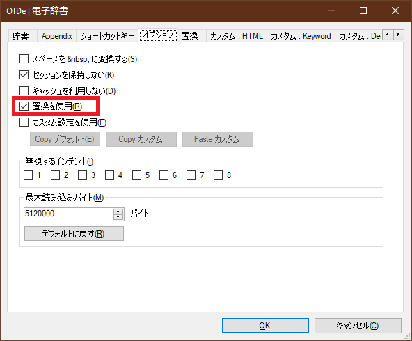
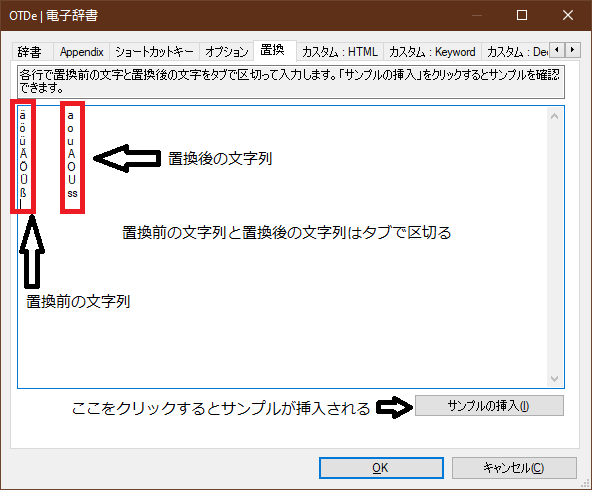

## 辞書の設定

### 電子辞書の設定方法

Dicregate に辞書を設定するには、メニューから「辞書」->「辞書を追加」->「電子辞書」を選択してください。そうするとダイアログボックスが表示されます。

ダイアログボックスが表示されたら、フォルダ選択のボタンをクリックしてフォルダを選択します。ここでは辞書があるフォルダを選択してください。

フォルダを選択後正常に辞書が読み込まれると、リストに辞書の一覧が表示されます。ここで辞書を１つ選択してください。

最後に OK をクリックすると、辞書が追加されます。

### WEB 辞書の設定方法

メニューから「辞書」->「辞書を追加」->「WWW」->「ウイザードモード」を選択してください。ダイアログが表示されます。

ブラウザを開き、希望の辞書サイトで適当な語句で検索します。日本語で検索できる場合は日本語を使用し、なるべく英語は避けてください。

ダイアログに検索した語句と結果の URL を入力します。ここで利用不可能と判断された場合はエラーが表示されます。エラーにならない場合でもうまく検索できない場合もあります。その時は検索でヒットしないような長い文字列を入力するとうまくいく場合もあります。

最後に任意の名前を入力して OK ボタンをクリックします。設定が完了したらタブが追加されます。一度タブを右クリックして「辞書の編集」を選び設定を確認してください。

（注）ウイザードモードだとうまく設定できない場合もあります。そういう場合はノーマルモードで登録できる場合があります。検索語句と URL の関係を調べて登録してください。

### 辞書の削除

タブを右クリックしてから「辞書を削除」を選択してください。

## ウィキペディアを追加

ウィキペディアはウィザードモードだとうまく設定できないので、ノーマルモードを利用して設定します。

・辞書の追加 → ノーマルモードを選択肢、以下のように入力します。

名前：ウィキペディア

> URL 前：https://ja.wikipedia.org/wiki/?search=  
> URL 後：  
> エンコード：utf-8 : Unicode (UTF-8)  
> ルール:デフォルト

・英語版のウィキペディアは以下のように設定できます。

名前：英語版ウィキペディア

> URL 前：https://www.wikipedia.org/w/wiki.phtml?search=  
> URL 後：  
> エンコード：utf-8 : Unicode (UTF-8)  
> ルール:デフォルト  
> フィルター：^[a-z|A-Z].\*$

・英語版のウィクショナリーは以下のように設定できます。

> 名前：英語版のウィクショナリー  
> URL 前：https://en.wiktionary.org/wiki/Special:Search?search=  
> URL 後：#English  
> エンコード：utf-8 : Unicode (UTF-8)  
> ルール:デフォルト  
> フィルター：^[a-z|A-Z].\*$

（注）これらの情報はサイトの仕様が変わると変更される場合があります。

## Google サイト絞込み

Google には特定のサイトから検索する機能があるのでそれを利用する設定例。

日本の政府系サイトから検索する例：

・辞書の追加 → ノーマルモードを選択肢、以下のように入力します。

名前：Google 日本政府
URL 前：http://www.google.co.jp/search?q=
URL 後：+site%3Ago.jp
エンコード：utf-8 : Unicode (UTF-8)
ルール:デフォルト

## 辞書の編集（電子辞書）

### 検索文字の置換

ドイツ語のウムラウト等の文字を検索したときに、文字を置換して検索する機能です。この機能を利用するには、電子辞書のタブを右クリックし、「辞書の編集」を選択します。

ダイアログのオプションタブで「置換を使用」をチェックします。

置換タブで置換したい文字と置換後の文字をタブで区切って入力します。



### 表示のカスタマイズ

Dicregate は Html をつかってデータを表示しています。html をカスタマイズすることによって自分の好きなようにデータを表示することができます。カスタマイズできるのは電子辞書のみで WWW の表示はカスタマイズできません。

カスタマイズするには、電子辞書のタブを右クリックし、「辞書の編集」を選択します。

ダイアログで「カスタム設定を使用」をチェックし、つぎのタブ「カスタム：html」を選択します。ここでは html の全体の先頭部を後方部を指定します。先頭部では html の<head>までを書き、後方部では</html>などでタグを閉じます。

例：前

```
<!DOCTYPE HTML PUBLIC "-//W3C//DTD HTML 4.01//EN">
<html>
<head>
<meta http-equiv="Content-Type" content="text/html; charset=euc-jp">
<style type="text/css">
body { line-height: 150% }
</style>
<title></title>
</head>
<body>
```

後：

```
</body></html>
```

html の charset は euc-jp にするようにしてください。

Keyword や Decoration のカスタマイズは、単語や語句単位で修飾するものです。どんな語句が keyword や Decoration になるかは辞書によって違います。

例：前

```
<font color="blue"><b>
```

例：後

```
</b></font>
```

## 辞書の編集（WEB 辞書）

### URL

検索ワードを挟んだ前後の文字列を指定して URL を形成します。「URL 前」と「URL 後」を指定します。URL 前に特殊文字列である dicregate://nosearchwordurl を指定し、URL 後に URL を指定すると、検索ワードなしの URL を指定できます。

### ブラウザ管理（IE のみ）

新しいウインドウを開くときに内部ブラウザを使う
これをチェックするとウェブページから新しいウインドウを開く際に Dicregate のサブウインドウを使って開くようになります。サブウインドウから新しいウインドウを開くときにもサブウインドウを使う場合は。一般の設定で設定します。「ツール」→「オプション」→「サブウインドウ」→「新しいウインドウを開くときに内部ブラウザを使う」をチェックしてください。

### イベント

特定の条件下で Javascript を実行できます。

#### Javascript の例１：

```
window.scroll(0,150);
```

これはページを 150 単位下にスクロールさせます。

#### Javascript の例２：

```
function scrolltotagclass(tag,clazz,order)
{
	var element;
	var found=0;
	var allElements = document.getElementsByTagName(tag);
	for (var i = 0; (element = allElements[i]) != null; i++) {
		var elementClass = element.className;
		if (element.className && element.className==clazz) {
			if(order==found) {
				element.scrollIntoView();
				return true;
			}
			++found;
		}
	}
	return false;
}

scrolltotagclass("div","endich1",0);
```

これは div の class 名が someclassname の 0 番目のエレメントにスクロールします。

#### Javascript の例３：

```
document.getElementById('someid').scrollIntoView();
```

これは id が someid のエレメントにスクロールします。

#### Javascript の例４：

```
if(!document.mycount)
{
  document.querySelector('.button').click();
  document.mycount=1;
}
```

mycount 変数を利用して一回のみ実行しています。querySelector で指定のクラススタイルをもつエレメントのクリックを実行します。

#### Javascript の例５：

```
alert(dicregate.searchWord)
```

特殊に設定される dicregate.searchWord を使って現在検索している文字列を取得できます。

### GET リクエストを使用せずに WEB 辞書を設定する

サイトによって URL クエリの中に検索ワードを指定しないものがあります。そのような場合は以下のようにして検索することができる場合があります。ここでは地理院地図 https://maps.gsi.go.jp/ の設定例です。

辞書の編集で以下のように設定します：

「URL 前」＝ dicregate://nosearchwordurl
「URL 後」＝ https://maps.gsi.go.jp/

「イベント」の Javascript:

```
if(!window.mapClicked && document.querySelector("body > div.gsi_dialog.ui-draggable.ui-resizable").style.display == 'none') {
 document.querySelector("#query").value=dicregate.searchWord;
 document.querySelector("#magnifyimage").click();
 setTimeout(() => {
  document.querySelector("body > div.gsi_dialog.ui-draggable.ui-resizable > div.gsi_dialog_content > div > div.searchresultdialog_ul_frame > ul > li > a").click();
 }, 2000);

 window.mapClicked=1;
}
```

しかしこの設定はサイトの構成が変わると動かなくなる可能性があります。

## グループ化

辞書が増えてくると、目的の辞書にアクセスするのに時間がかかります。グループ機能を使えば目的の辞書に即座にアクセスできるようになります。グループ機能とはいくつかの辞書を１つのグループにまとめる機能です。たとえば「国語辞典」と言うグループや「英語辞典」などのグループをつくり、そのグループの中に辞書を入れて使います。

### グループを作成する

メニューから「グループ」->「グループの作成」をクリックし、テキストエリアに好きな名前を入力し、メニュー以外の場所をクリックしメニューを閉じます。これでグループが作成されます。もう一度メニューから「グループ」をクリックすると今作成したグループが表示されているはずです。

### グループに辞書を追加する

グループに追加したい辞書のタブを右クリックし、 「グループに追加」から希望のグループに追加します。

### グループを開く

グループを開くには、メニューの「グループ」から希望のグループをクリックします。グループ内に含まれる辞書がタブの先頭に並び替えられます。これで希望の辞書にすばやくアクセスすることができます。

### グループの名前変更、順番変更、削除

メニューの「グループ」から対象のグループを右クリックし、希望の動作を行います。

### グループ内の辞書の順番変更、削除

メニューの「グループ」の希望のグループのサブメニューから希望の辞書を右クリックし、希望の動作を行います。

## マウスジェスチャー

以下のマウスジェスチャーが使えます。まだカスタマイズなどはできません。ブラウザペイン内で行います。

←
ブラウザの戻る

→
ブラウザの進む

↑
ページの先頭へ

↓
ページの最後へ

↑←
先頭のタブへ

↑→
最後のタブへ

## クリップボードとの連携

### クリップボードにコピーされたテキストを履歴に追加する

メニューから[ツール]→[オプション]→[一般設定]→[クリップボード監視]をチェックすると、クリップボードにテキストがコピーされるたびに履歴にテキストが追加されます。

### クリップボードにコピーされたときに検索を実行する

上記の[クリップボードの監視]をチェックした状態で、[クリップボードから検索]を[有効]にするとクリップボードにテキストがコピーされたとき検索が行われるようになります。ただし辞書の設定で、クリップーボードからの検索を許可している辞書に限ります。許可されていない辞書の場合は、タブのアイコンがＸになります。このときタブをダブルクリックすると検索を実行します。

<span style="color: red; ">
（注）クリップボードからインターネットサイトを検索することはセキュリティ上好ましくないと考えられます（大事なテキストをクリップボードにコピーしたときネットにデータが送信されてしまうため）。この機能を利用するときは注意してください。
</span>

## D&D からの検索

Dicregate ウインドウの左上の検索結果リストウインドウと左下の履歴ウインドウにテキストをＤ＆Ｄ（ドラッグアンドドロップ）したときに検索を実行したり、グループを選択して検索を実行したりできます。

メニューの[ツール]→[一般設定]→[検索リストテキストドロップ時]
または
[ツール]→[一般設定]→[履歴ツリーテキストドロップ時]

から希望の動作を選択します。このとき[すべての辞書で検索]を選んだ場合、登録されているすべての辞書で検索するか、選択されているグループの辞書で検索するかは、メニューの[ツール]→[検索]→[見出し検索]の設定値に従います。

## 英単語や漢字の変換

### 不規則動詞の変換

付属している"fukisokueigo.csv.zip"を解凍して"fukisokueigo.csv"というファイルを dicregate.exe と同じフォルダにおくと、検索履歴を右クリックしたときの候補一覧に不規則動詞の原型が表示されるようになります。

たとえば"gave up"の候補に"give up"が出るようになります。

### 旧漢字の変換

同様に付属している"kanjiq2s.csv.zip"を解凍して kanjiq2s.csv をおくと旧漢字が新字として候補に表示されます。ただこのファイルには数個のエントリしかないため、自分で充実させる必要があります。

## 外部ツール

外部のプログラムを登録して、実行時のパラメータを伴って起動することができます。登録するにはメニューから[ツール][外部ツール]を選択してダイアログを表示します。

### 起動

タブから起動するにはタブのコンテキストメニューから起動します。

サブウインドウから起動する場合はメニューボタンをクリックして[表示][外部ツール]から起動します。

### 引数

$(Url) : 現在の URL が設定されます。

$(ActiveTabUrl) : タブのコンテキストメニューを表示したときのタブの URL が設定されます。サブウインドウから起動された場合は、空文字が設定されます。

$(SelectedTabUrl) : 現在選択されているタブの URL が設定されます。
